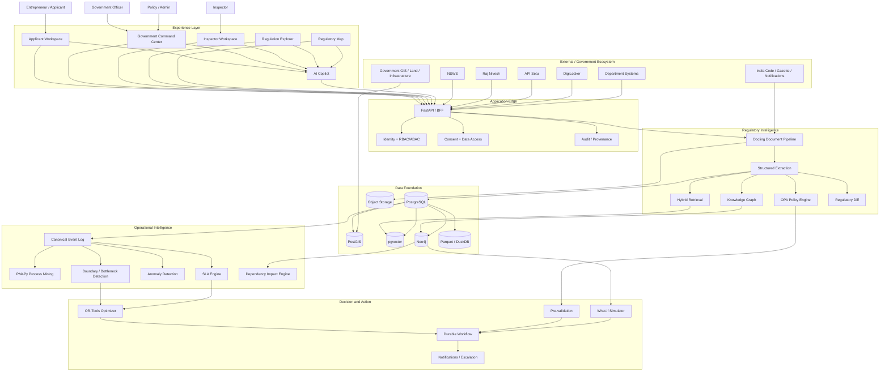
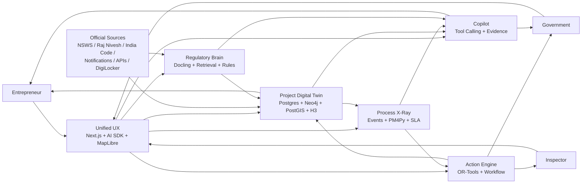

# Regulatory Operating System — Architecture

## Smart India Hackathon — Intelligent Approval & Compliance Platform

> **Status:** Implementation architecture for an advanced SIH prototype
>
> **Primary objective:** Build a unified, explainable, intelligent approval-and-compliance layer for entrepreneurs, departments, inspectors and administrators — without pretending that an LLM itself is the statutory decision-maker.
>
> **Core idea:** Do not build another single-window portal. Build a **computational model of the project's relationship with government**: location, jurisdiction, regulations, approvals, documents, dependencies, applications, events, inspections, SLAs, incentives and compliance.

---

## 1. Problem Alignment

The problem requires a system that simplifies and accelerates the end-to-end journey for entrepreneurs while improving departmental visibility and coordination.

### Applicant-side requirements

- Identify applicable registrations, licences, permissions, NOCs and inspections.
- Adapt requirements to sector, location, project size, stage and other project attributes.
- Explain documentation requirements.
- Pre-validate submissions before they enter departmental scrutiny.
- Reuse verified information/documents where permitted.
- Track applications, queries, deadlines, approvals, renewals and incentives from one workspace.
- Reduce repeated manual discovery and repeated document submission.

### Department-side requirements

- Improve completeness before scrutiny.
- Reduce repetitive verification.
- Coordinate parallel departmental work.
- Track application states and statutory/service timelines.
- Detect bottlenecks and abnormal process behaviour.
- Schedule and optimize inspections.
- Support escalation and grievance handling.
- Produce analytics about delays, workload, rework and process performance.
- Maintain statutory safeguards, human authority and auditability.

### Differentiation target

The prototype should go beyond a conventional dashboard by providing five system-level capabilities:

1. **Regulatory Intelligence** — regulations become structured, searchable, versioned and traceable.
2. **Project Digital Twin** — every project has a live graph of its regulatory obligations and current state.
3. **Process Intelligence** — the platform can explain how applications actually move through departments.
4. **Decision + Optimization** — rules, dependency analysis and constrained optimization produce actionable next steps.
5. **Impact Simulation** — changing a project parameter or regulation propagates through the dependency graph.

---

## 2. Product Vision

### Product name for architecture purposes

**Regulatory OS**

The product has three primary experiences sharing one intelligence core:

```text
                     REGULATORY OS
                           │
          ┌────────────────┼────────────────┐
          │                │                │
          ▼                ▼                ▼
      APPLICANT         GOVERNMENT       INSPECTOR
      EXPERIENCE        COMMAND         WORKSPACE
          │                │                │
          └────────────────┼────────────────┘
                           │
                 INTELLIGENCE CORE
                           │
          ┌────────────────┼────────────────┐
          ▼                ▼                ▼
      Regulatory         Process        Optimization
      Intelligence      Intelligence    Intelligence
```

### Human-facing promise

> **“Tell the system what you are building. It determines the regulatory journey, explains why each requirement exists, checks your documents, tracks the live journey, identifies blockers, and helps the government coordinate the next action.”**

The system should feel like an intelligent operating layer rather than a form-filling portal.

---

## 3. Design Principles

### 3.1 User-first, not technology-first

The judge or end user should see a simple experience:

```text
What are you building?
        ↓
Where?
        ↓
Analyze
        ↓
Your regulatory journey appears
```

Complex technologies remain underneath the interface.

### 3.2 Evidence before generation

Every material regulatory explanation should maintain a chain:

```text
SOURCE DOCUMENT
      ↓
EXTRACTED FACT
      ↓
RULE / CONDITION
      ↓
GRAPH RELATIONSHIP
      ↓
DECISION / RECOMMENDATION
      ↓
ACTION
```

### 3.3 AI assists; statutory authority remains human

AI can extract, summarize, compare, retrieve, explain, identify inconsistencies and suggest next actions.

Machine-checkable rules can be evaluated deterministically.

Final statutory approvals/rejections remain with the authorized department workflow unless the real government system explicitly delegates a particular decision.

### 3.4 Existing government systems are integration targets

The system should be designed as an intelligence/orchestration layer above existing portals and departmental systems rather than requiring wholesale replacement.

### 3.5 Fast prototype, production-grade direction

The hackathon implementation should use a small number of powerful components. Avoid infrastructure theatre.

---

## 4. Current Ecosystem Assumption

The architecture intentionally fits the Indian single-window ecosystem.

- **NSWS** provides a centralized investment/approval discovery and application experience, including Know Your Approvals, application/status concepts and document repository capabilities; after submission, downstream departmental systems may handle processing. See: https://www.nsws.gov.in/
- **Raj Nivesh** provides Rajasthan-specific investor services including Know Your Approvals, application and query tracking, service timelines, GIS/land information, inspection-related workflows, compliance/penal information and incentives. See: https://rajnivesh.rajasthan.gov.in/
- **India Code** provides access to Acts, rules, regulations, notifications, orders, ordinances and related legal material. See: https://www.indiacode.nic.in/
- **API Setu** provides a government API discovery/integration layer. See: https://apisetu.gov.in/
- **DigiLocker** provides a consent-oriented digital document ecosystem with API gateway and digitally signed documents. See: https://www.digilocker.gov.in/web/architecture

Therefore, the prototype is not positioned as “another single-window portal.” It is a **regulatory intelligence and operational coordination layer** capable of integrating with such systems.

---

# 5. High-Level Architecture



---

# 6. Architecture Layers

## Layer 1 — Experience Layer

### Applicant

- conversational project onboarding
- voice/text project description
- project profile
- site selection map
- regulatory journey
- approval dependency graph
- document workspace
- query/clarification center
- application tracker
- renewal center
- incentive discovery
- evidence/“Why?” panel
- what-if simulator

### Government

- command center
- case queue
- SLA heatmap
- bottleneck map
- process x-ray
- dependency blast radius
- document exception queue
- inspection workload
- optimization console
- regulatory change impact
- organization/project 360 view

### Inspector

- assigned inspections
- route / schedule
- project details
- checklist
- photo/evidence capture
- observations
- completion event

---

# 7. The User Journey

## 7.1 Applicant — the experience should begin with intent

Instead of opening with a large dashboard:

```text
┌─────────────────────────────────────────┐
│ What are you planning to build?         │
│                                         │
│ “A food processing plant…”               │
│                                         │
│                 🎙 Speak               │
│                                         │
│         [ Analyse My Project ]          │
└─────────────────────────────────────────┘
```

The conversational onboarding converts natural language into a structured project profile.

### Extracted fields

```text
sector
project type
investment
capacity
land requirement
location
employment
utilities
project stage
ownership profile
other relevant attributes
```

The LLM does not decide legal applicability. It creates structured input for the regulatory engine.

---

# 8. Project Digital Twin

Every project becomes a structured object plus graph.

```text
PROJECT
 │
 ├── COMPANY
 │
 ├── SITE
 │    ├── H3 CELL
 │    ├── JURISDICTIONS
 │    ├── LAND / GIS CONTEXT
 │    └── SPATIAL CONSTRAINTS
 │
 ├── REGULATIONS
 │
 ├── APPROVALS
 │    ├── REQUIRED
 │    ├── CONDITIONAL
 │    └── COMPLETED
 │
 ├── DOCUMENTS
 │
 ├── APPLICATIONS
 │
 ├── INSPECTIONS
 │
 ├── QUESTIONS / QUERIES
 │
 ├── SLA CLOCKS
 │
 ├── INCENTIVES
 │
 └── COMPLIANCE / RENEWALS
```

The digital twin is not a 3D object. It is a **live computational representation of regulatory state and dependencies**.

---

# 9. Regulatory Fingerprint

A key differentiator is turning geography into regulatory context.

```text
USER CHOOSES SITE
       ↓
LAT/LON
       ↓
H3 CELL
       ↓
POSTGIS
       ↓
JURISDICTION / ZONES / SPATIAL CONDITIONS
       ↓
REGULATORY GRAPH
       ↓
PROJECT REGULATORY FINGERPRINT
```

### Example UI

```text
REGULATORY FINGERPRINT

Jurisdictions              3
Applicable rule groups    18
Potential approvals      21
Conditional documents    47
Potential inspections      6
Incentive candidates       5
```

Values must be calculated from loaded rules and datasets, not invented by the AI.

### Technology

- H3 — spatial indexing and hierarchical aggregation
- PostGIS — geometry, containment, proximity, intersection
- MapLibre GL JS — map rendering
- deck.gl — GPU-accelerated visualization of H3 and other spatial layers

---

# 10. Regulatory Knowledge Graph

## Core entities

```text
Company
Project
Site
Jurisdiction
Regulation
Clause
Rule
Approval
Application
Document
Department
Officer
Inspection
Query
Event
SLA
Scheme
Certificate
ComplianceRequirement
```

## Core relationships

```text
Company ──OWNS──> Project
Project ──LOCATED_AT──> Site
Site ──INSIDE──> Jurisdiction
Jurisdiction ──ACTIVATES──> Regulation
Regulation ──CONTAINS──> Clause
Clause ──EXPRESSES──> Rule
Rule ──REQUIRES──> Approval
Rule ──CONDITIONS──> Approval
Approval ──REQUIRES──> Document
Approval ──PROCESSED_BY──> Department
Application ──REQUESTS──> Approval
Application ──GENERATES──> Event
Application ──MAY_REQUIRE──> Inspection
Inspection ──ASSIGNED_TO──> Officer
Approval ──BLOCKS──> Approval
Approval ──DEPENDS_ON──> Approval
Rule ──AFFECTS──> Application
RegulationVersion ──SUPERSEDES──> RegulationVersion
```

### Why Neo4j?

The value is not merely storing relationships. It enables path and dependency analysis. Neo4j Graph Data Science provides algorithms including shortest-path and centrality families that can be used later for dependency analysis and network intelligence.

Reference: https://neo4j.com/docs/graph-data-science/current/

---

# 11. The “WHY?” Evidence Engine

Every requirement should have an explainability path.

```text
APPROVAL
   ↓
WHY?
   ↓
Project attribute
   ↓
Site / jurisdiction
   ↓
Applicable rule
   ↓
Clause
   ↓
Source document
   ↓
Page / section
```

### Example

```text
WHY IS THIS APPROVAL REQUIRED?

Triggered by:
• Sector = Food Processing
• Project size = X
• Site = Jurisdiction Y

Rule:
<validated machine-readable rule>

Source:
<official notification>
Page:
17
Clause:
4.2
Effective:
<date>

[ Open source document ]
```

This is the primary defense against unsupported LLM-generated legal explanations.

---

# 12. Regulation-as-Code

Regulatory documents contain natural-language rules, but the application needs structured conditions.

Pipeline:

```text
OFFICIAL DOCUMENT
      ↓
DOCLING
      ↓
STRUCTURE / TABLE / SECTION EXTRACTION
      ↓
LLM-ASSISTED FACT EXTRACTION
      ↓
CANDIDATE RULE
      ↓
HUMAN / DOMAIN VALIDATION
      ↓
OPA POLICY
      ↓
DETERMINISTIC EVALUATION
```

Open Policy Agent is designed to evaluate structured inputs against declarative policy using Rego. It separates policy decision logic from application enforcement.

Reference: https://www.openpolicyagent.org/docs

### Rule object

```json
{
  "rule_id": "RULE-RAJ-0001",
  "version": 3,
  "jurisdiction": "Rajasthan",
  "effective_from": "2026-01-01",
  "source_document_id": "DOC-123",
  "source_page": 17,
  "source_clause": "4.2",
  "conditions": [
    {"field": "project.sector", "operator": "equals", "value": "X"},
    {"field": "project.investment", "operator": ">", "value": 50000000}
  ],
  "decision": {
    "approval_required": true,
    "approval_type": "APPROVAL-X"
  }
}
```

The exact threshold/value must come from the authoritative source loaded by the implementation, not from an example.

---

# 13. Document Intelligence Pipeline

## Goal

Turn government and applicant documents into trusted structured information.

### Pipeline

```text
PDF / DOCX / IMAGE / HTML
          ↓
      DOCLING
          ↓
layout + reading order + tables + sections
          ↓
structured representation
          ↓
LLM extraction
          ↓
entities + conditions + metadata
          ↓
Postgres / pgvector / Neo4j
```

Docling currently supports broad document ingestion and advanced PDF understanding including layout, reading order and table structure.

Reference: https://github.com/docling-project/docling

### Store both

1. Original artifact.
2. Parsed/derived representation.

Never discard the original source.

---

# 14. Applicant Document Intelligence

User uploads:

```text
PAN
GST certificate
incorporation certificate
land document
project report
existing licences
other certificates
```

System performs:

```text
Document extraction
        ↓
Field extraction
        ↓
Schema validation
        ↓
Cross-document comparison
        ↓
Requirement matching
        ↓
Exception generation
```

### Output

```text
DOCUMENT HEALTH

✓ Company name consistent
✓ PAN detected
✓ GST detected
⚠ Address mismatch
⚠ Expiry approaching
✕ Land area missing
```

This directly targets the PS requirement of incomplete applications and repetitive scrutiny.

---

# 15. Cross-Document Consistency Engine

This is a high-value, relatively fast-to-implement feature.

### Example

```text
Document A: ABC Manufacturing Pvt Ltd
Document B: ABC Manufacturing Private Limited
Document C: ABC Mfg Pvt Ltd
Application: ABC Industrial Works
```

The system creates a potential entity mismatch alert rather than blindly accepting all documents.

### Checks

- business name
- registration number
- PAN/GST identifiers
- address
- project area
- capacity
- investment amount
- land parcel
- expiry dates
- certificate numbers

### Implementation

Start with deterministic normalized-field comparisons plus fuzzy matching. Add LLM assistance only for ambiguous cases.

---

# 16. Hybrid Retrieval

A regulatory assistant should never depend on vector search alone.

Use:

```text
Exact / lexical search
        +
Vector search (pgvector)
        +
Knowledge-graph traversal
        +
Metadata filters
        ↓
Evidence set
```

### Query flow

```text
USER QUESTION
      ↓
Intent / entities
      ↓
Retrieve exact terms
      ↓
Retrieve semantically similar passages
      ↓
Traverse regulatory graph
      ↓
Filter by jurisdiction + effective date
      ↓
Evidence ranking
      ↓
LLM answer with citations
```

Store retrieval metadata including source, effective dates and document version.

---

# 17. Applicant “What do I need to do?”

The primary dashboard should be an action-oriented journey.

```text
YOUR PROJECT

██████████████████░░░░ 72%

NEXT ACTION

Upload:
• Land ownership document
• Project layout

BLOCKING:
Approval C

WAITING ON GOVERNMENT:
Approval A

CAN RUN IN PARALLEL:
Approval B + D
```

The platform should answer:

- What do I need to do now?
- What is waiting on me?
- What is waiting on government?
- What can proceed in parallel?
- What could block the next stage?
- What will expire soon?

---

# 18. Approval Dependency Graph

The system should represent the journey as a DAG wherever possible.

```text
                      PROJECT
                         │
             ┌───────────┼───────────┐
             ↓           ↓           ↓
         Approval A  Approval B   Approval C
             │           │           │
             └──────┬────┴───────────┘
                    ↓
              Approval D
                    ↓
                Inspection
                    ↓
                 Decision
```

### Important properties

- prerequisite approvals
- optional vs mandatory paths
- conditional dependencies
- statutory waiting periods
- document dependencies
- inspection dependencies
- department handoffs

The graph is the foundation for parallelization, blast-radius analysis and simulation.

---

# 19. Parallel Approval Planner

A conventional portal displays approvals individually.

This system calculates which work can happen concurrently.

```text
CURRENT VIEW

A → B → C → D

DEPENDENCY ANALYSIS

A ──┬──> B ──┐
    ├──> C ──┼──> D
    └──> X ──┘
```

The system labels:

```text
CAN RUN IN PARALLEL
Approval B
Approval C
Approval X
```

This should be framed as **dependency-based coordination**, not a promise to bypass statutory requirements.

---

# 20. Process X-Ray

The government side should use a canonical application event model.

### Event vocabulary

```text
APPLICATION_CREATED
PROFILE_COMPLETED
DOCUMENT_UPLOADED
DOCUMENT_VALIDATED
SUBMITTED
ROUTED
ASSIGNED
SCRUTINY_STARTED
QUERY_RAISED
QUERY_RESPONDED
SCRUTINY_RESUMED
INSPECTION_REQUIRED
INSPECTION_SCHEDULED
INSPECTION_STARTED
INSPECTION_COMPLETED
DECISION_RECORDED
APPROVED
REJECTED
CERTIFICATE_ISSUED
RENEWAL_DUE
COMPLIANCE_EVENT
```

Department-specific statuses are mapped into this common vocabulary.

Example:

```text
“Pending With Officer”
“Under Examination”
“Scrutiny”
          ↓
    SCRUTINY_STARTED
```

---

# 21. Event Schema

Every state-changing event should have a standard envelope.

```json
{
  "event_id": "evt_123",
  "application_id": "app_456",
  "event_type": "QUERY_RAISED",
  "occurred_at": "2026-09-28T10:15:00+05:30",
  "actor_type": "DEPARTMENT_OFFICER",
  "actor_id": "officer_001",
  "department_id": "dept_009",
  "previous_state": "UNDER_SCRUTINY",
  "new_state": "QUERY_RAISED",
  "reason_code": "MISSING_DOCUMENT",
  "source_system": "DEPARTMENT_PORTAL",
  "source_reference": "external-id",
  "correlation_id": "case_456",
  "sla_clock": {
    "elapsed_hours": 36,
    "remaining_hours": 132
  }
}
```

This makes the same data usable by workflow, audit, analytics and process mining.

---

# 22. Process Mining

Use **PM4Py** to discover actual process behavior from event logs.

PM4Py is an open-source Python process-mining library supporting process discovery and analysis.

Reference: https://processintelligence.solutions/pm4py

### Input

```text
case_id
activity
timestamp
resource
department
```

### Output

- directly-follow graphs
- discovered process models
- cycle time
- queue time
- rework
- loops
- conformance deviations
- handoff counts

### Example

```text
EXPECTED

Submit
  ↓
Scrutiny
  ↓
Inspection
  ↓
Decision
```

versus:

```text
OBSERVED

Submit
  ↓
Scrutiny
  ↓
Query
  ↓
Response
  ↓
Scrutiny
  ↓
Query
  ↓
Response
  ↓
Inspection
  ↓
Decision
```

This exposes process friction without requiring the system to invent causes.

---

# 23. Government Process Bottleneck Engine

Combine:

```text
Event log
   ↓
Process mining
   ↓
Queue/cycle-time analysis
   ↓
SLA analysis
   ↓
Dependency graph
   ↓
Bottleneck candidates
```

### Command Center output

```text
TOP BOTTLENECK

Document Verification

Cases affected          117
Median queue time       8.4 days
Downstream dependencies 31
SLA-risk cases            9

[Investigate]
[Show applications]
[Optimize workload]
```

The numbers shown in a real implementation must come from the event dataset.

---

# 24. Dependency Blast Radius

This is a core “Palantir-like” analytical capability.

If Approval B is delayed:

```text
Approval B
    ↓
Approval C
    ↓
Inspection
    ↓
Final Decision
```

Graph traversal calculates:

```text
Immediate dependencies
Downstream approvals
Blocked inspections
Affected applications
Potential SLA impact
```

### UI

```text
⚠ BLOCKER DETECTED

Approval B

Downstream impact

3 approvals
12 applications
7 inspections
```

Do not present this as a prediction with false precision. It is graph-derived impact based on explicit dependencies.

---

# 25. SLA Intelligence

Track separate clocks where required:

```text
Applicant clock
Department clock
Inspection clock
Query-response clock
Statutory/service deadline
```

Every application should show:

```text
STATUS

Under scrutiny

SLA

████████████░░░░

6 days remaining

At-risk reason:
Waiting for inspection slot
```

### Useful metrics

- elapsed processing time
- active queue time
- applicant waiting time
- departmental processing time
- inspection wait time
- rework time
- number of handoffs

---

# 26. Inspection Intelligence

Inspection is where optimization becomes visible.

### Input dataset

```text
inspection_id
application_id
site_lat
site_lon
district
priority
required_skill
time_window_start
time_window_end
duration
deadline
inspector_id
inspector_skill_set
```

### Optimization pipeline

```text
Inspections
      ↓
Constraints
      ↓
Candidate assignments
      ↓
OR-Tools
      ↓
Assignment + sequence + routes
```

### Constraints

- inspector availability
- skills
- geographic distance
- time windows
- inspection duration
- statutory deadline
- priority
- maximum daily load

OR-Tools provides routing and constrained optimization capabilities that fit this class of problem.

Reference: https://developers.google.com/optimization

---

# 27. Inspection Experience

Inspector mobile/PWA screen:

```text
TODAY

09:10  Factory A
10:25  Factory C
12:15  Factory D
14:35  Factory H
```

Open inspection:

```text
PROJECT
SITE
APPLICATION
REQUIRED CHECKS

☐ Fire safety
☐ Equipment
☐ Environment
☐ Labour
☐ Site condition

[Photo]
[Observation]
[Complete inspection]
```

Completion emits an event into the same event log.

This closes the feedback loop.

---

# 28. Regulatory Change Intelligence

A new government notification is treated as a versioned source update.

```text
NEW NOTIFICATION
       ↓
DOCLING
       ↓
STRUCTURED EXTRACTION
       ↓
RULE VERSION
       ↓
GRAPH DIFF
       ↓
IMPACT ANALYSIS
```

### “Git diff for regulations” UI

```diff
OLD
investment threshold > X

NEW
investment threshold > Y
```

Then:

```text
AFFECTED

7 rules
4 approvals
3 departments
2 forms
31 open applications
```

The impact set must be derived from actual graph relationships.

---

# 29. Regulatory What-if Simulator

The strongest applicant-side demo feature.

### Baseline

```text
Site A
₹40 Cr
Sector X
```

### Change one parameter

```text
Site A → Site B
```

### Recompute

```text
Location
 ↓
H3 / PostGIS
 ↓
Jurisdiction
 ↓
Rules
 ↓
Approval graph
 ↓
Documents / inspections
 ↓
Timeline dependencies
```

UI animates the delta:

```diff
APPROVALS
21 → 24

DOCUMENTS
47 → 54

INSPECTIONS
6 → 7

NEW DEPENDENCIES
+ Zoning
+ Groundwater-related condition
```

Only configured rules produce changes.

---

# 30. Regulatory Fingerprint + What-if = Spatial Intelligence

Every site gets a computed profile.

```text
H3 CELL
   ↓
SPATIAL FEATURES
   ↓
REGULATORY JURISDICTION
   ↓
RULE SET
   ↓
PROJECT CONDITIONS
   ↓
REGULATORY FINGERPRINT
```

The map should support:

- jurisdictions
- industrial areas
- land parcels
- relevant infrastructure
- project locations
- inspections
- approval density
- delay hotspots
- regulatory-change hotspots

The map is an **analysis surface**, not merely decoration.

---

# 31. Entity Resolution / Organization 360

Government data frequently uses different names/representations across systems.

Example:

```text
ABC Manufacturing Pvt Ltd
ABC Manufacturing Private Limited
ABC Mfg Pvt Ltd
```

Resolve potential matches into a canonical organization entity.

Then:

```text
              COMPANY
                 │
      ┌──────────┼──────────┐
      ↓          ↓          ↓
   PROJECTS   LICENCES   INSPECTIONS
      ↓
    SITES
      ↓
  APPROVALS
      ↓
 COMPLIANCE
```

### Implementation

Fast MVP:

1. normalized identifiers
2. exact ID matching
3. normalized names
4. fuzzy matching
5. human confirmation for ambiguous cases

Do not use entity resolution as a basis for an irreversible legal action without verification.

---

# 32. Incentive Intelligence

The PS explicitly mentions access to incentives/support schemes.

Treat schemes as graph entities:

```text
PROJECT
  ↓
ELIGIBILITY CONDITIONS
  ↓
SCHEME
  ↓
REQUIRED DOCUMENTS
  ↓
APPLICATION
  ↓
CLAIM / BENEFIT
```

The user experience should answer:

```text
Potential schemes to examine

Scheme A
Why matched:
• sector
• location
• investment band

Scheme B
Why matched:
• employment threshold
• project stage
```

The system should distinguish:

- “potentially relevant”
- “rule-evaluated as eligible”
- “application submitted”
- “benefit granted”

Do not claim entitlement unless the actual governing process confirms it.

---

# 33. Government Command Center

The first screen should answer:

> **Where is the system blocked right now?**

```text
┌────────────────────────────────────────────┐
│        REGULATORY OPERATIONS CENTER        │
├────────────────────────────────────────────┤
│                                            │
│ ACTIVE      SLA RISK      BLOCKED          │
│ 1,482         82            117            │
│                                            │
│ ------------------------------------------ │
│              LIVE REGULATORY MAP           │
│                                            │
│       ● ● ● ● 🔴 ● ●                       │
│     ● ● 🔴 ● ● ● ●                         │
│                                            │
│ ------------------------------------------ │
│ TOP BOTTLENECK                             │
│ Document Verification                      │
│                                            │
│ 117 cases                                  │
│ 8.4 day median queue                       │
│ 31 downstream dependencies                 │
│                                            │
│ [INVESTIGATE]        [OPTIMIZE]            │
└────────────────────────────────────────────┘
```

The UI should be sparse, dense with useful information, and interaction-driven.

---

# 34. Government “Why?”

Every system insight should be drillable.

Example:

```text
WHY ARE THESE 117 CASES BLOCKED?

117 applications
       ↓
Document Verification
       ↓
Queue increased
       ↓
31 downstream dependency paths
       ↓
14 cases nearing SLA limit
```

The system should let the officer navigate from aggregate → department → application → event → source.

---

# 35. AI Copilot Architecture

The copilot is not a generic chat interface.

It is a tool-using interface to the operational system.

```text
USER
  ↓
LLM
  ↓
INTENT / TOOL SELECTION
  ├── get_project()
  ├── get_site_rules()
  ├── search_regulations()
  ├── get_approval_graph()
  ├── check_documents()
  ├── check_sla()
  ├── analyze_bottleneck()
  ├── get_impact()
  ├── simulate_change()
  └── optimize_inspections()
  ↓
RESULTS FROM AUTHORITATIVE SYSTEMS
  ↓
LLM EXPLANATION
  ↓
EVIDENCE / LINKS / ACTIONS
```

### Example questions

Applicant:

- “What am I missing?”
- “Why do I need this?”
- “Can these run in parallel?”
- “What changed if I move this project?”
- “What is waiting on government?”

Officer:

- “Why are these applications delayed?”
- “Which bottleneck has the largest downstream impact?”
- “Which cases are approaching their service deadline?”
- “Show applications affected by this rule.”
- “Optimize today's inspections.”

---

# 36. Voice / Multilingual Interface

Optional but high-impact for the demo.

```text
USER SPEAKS
     ↓
Speech-to-text / language detection
     ↓
Structured project extraction
     ↓
Regulatory analysis
     ↓
Response in preferred language
```

India’s BHASHINI ecosystem provides language technology capabilities that can support speech, translation and related multilingual interactions.

Reference: https://bhashini.gov.in/

For the prototype, integrate an available supported language API only after the core text flow works.

---

# 37. Data Architecture

Use a Bronze → Silver → Gold design.

## Bronze — raw source truth

```text
bronze/
  nsws/
  rajnivesh/
  india-code/
  gazettes/
  notifications/
  department/
  gis/
  applicant-documents/
```

Store:

- raw API JSON
- raw HTML
- raw PDFs
- raw CSV/Parquet
- original uploaded files

---

## Silver — normalized government data

Convert heterogeneous sources into canonical models.

Example:

```json
{
  "approval_id": "APP-001",
  "name": "Example Approval",
  "department_id": "DEPT-001",
  "jurisdiction": "Rajasthan",
  "stage": "PRE_ESTABLISHMENT",
  "source_system": "RAJ_NIVESH",
  "source_record_id": "123",
  "effective_from": "2026-01-01"
}
```

---

## Gold — intelligence artifacts

Examples:

```text
project_regulatory_fingerprint
approval_dependency_graph
process_metrics
bottleneck_metrics
inspection_assignments
regulatory_impact_sets
entity_resolution_candidates
```

---

# 38. Data Sources and Reality Constraints

## Expected source categories

| Source | Primary use | Access assumption |
|---|---|---|
| NSWS | approval discovery, KYA, application/document concepts | public/authorized integration where available |
| Raj Nivesh | Rajasthan services, timelines, tracking, GIS/inspection/incentive context | public/authorized integration |
| India Code | legal texts and related legal material | public |
| Official notifications/gazettes | current regulatory changes | public/official source |
| API Setu | interoperable government services | authorized API access |
| DigiLocker | trusted digital document exchange | consented/authorized access |
| Department portals | actual departmental workflows/statuses | integration dependent |
| Government GIS/land data | site context | source/access dependent |

### Important data limitation

A public website does not necessarily expose the complete internal event history of a department. The prototype must not manufacture historical departmental performance statistics.

### Strategy

- use real official regulatory source material wherever available;
- use real service metadata and publicly visible process/status information where accessible;
- create a canonical event schema for future department adapters;
- use clearly labelled synthetic event data only where internal historical event logs are unavailable for the demo;
- never present synthetic records as real government performance statistics.

---

# 39. Core Relational Model

PostgreSQL is the system of record for transactional data.

### Core tables

```text
users
organizations
projects
sites
jurisdictions
applications
approvals
approval_dependencies
documents
document_extractions
document_requirements
queries
inspections
inspection_assignments
events
sla_clocks
rules
rule_versions
regulations
regulation_versions
schemes
scheme_requirements
entity_matches
notifications
audit_logs
data_sources
source_documents
source_citations
```

### PostgreSQL responsibilities

- transactions
- application state
- users/roles
- project records
- canonical events
- document metadata
- SLA clocks
- approvals
- operational reporting

---

# 40. PostGIS Responsibilities

Use PostGIS for:

- point/line/polygon storage
- jurisdiction lookup
- site containment
- spatial intersections
- nearest facility calculations
- inspector/project distances
- GIS overlays
- regulatory zone analysis

Example conceptual query:

```sql
SELECT jurisdiction_id
FROM jurisdiction_boundaries
WHERE ST_Contains(geometry, ST_SetSRID(ST_Point(:lon, :lat), 4326));
```

Actual data source and SRID must match the dataset.

---

# 41. H3 Responsibilities

H3 should be the common spatial index across datasets.

Use it for:

- location bucketing
- multi-resolution aggregation
- regional heatmaps
- regulatory fingerprints
- inspection density
- process-delay geography
- infrastructure proximity layers

Store H3 indexes on relevant entities rather than repeatedly recomputing them.

Reference: https://h3geo.org/

---

# 42. Neo4j Responsibilities

Do not move the entire application database into Neo4j.

Use Neo4j specifically for relationship-heavy questions:

- Why is this approval required?
- Which approval blocks this one?
- Which applications are affected by this rule?
- Which departments are in this dependency path?
- What changes if this rule version is superseded?
- What projects are connected to this organization/site?

PostgreSQL remains the transactional system of record.

---

# 43. pgvector Responsibilities

Use pgvector for:

- regulation passage embeddings
- document chunk embeddings
- source semantic search
- applicant document semantic matching
- scheme discovery

Use metadata filters:

```text
jurisdiction
sector
effective_from
effective_to
document_type
source_authority
```

This prevents retrieval from surfacing semantically similar but legally irrelevant material.

Reference: https://github.com/pgvector/pgvector

---

# 44. Object Storage Responsibilities

Store:

- original government PDFs
- uploaded applicant documents
- inspection photos
- generated evidence snapshots
- source artifacts

Recommended prototype:

**Supabase Storage** or an S3-compatible store.

---

# 45. DuckDB / Parquet

Use only when analytics becomes heavier than transactional SQL.

Good for:

- historical event analysis
- large public CSV/Parquet datasets
- batch computation
- offline analysis notebooks

Do not introduce a distributed data warehouse for the hackathon.

---

# 46. Workflow Architecture

Long-running regulatory processes need durable state.

### Target

**Temporal**

Example:

```text
APPLICATION_SUBMITTED
        ↓
WAIT FOR DEPARTMENT
        ↓
QUERY_RAISED
        ↓
WAIT FOR APPLICANT
        ↓
INSPECTION
        ↓
WAIT FOR DECISION
        ↓
CERTIFICATE_ISSUED
```

Temporal is designed for durable workflows that continue across failures and long waits.

Reference: https://docs.temporal.io/

### MVP shortcut

Before Temporal is introduced, implement the same workflow as a PostgreSQL state machine plus event log. The application should use a workflow interface so Temporal can be inserted later without rewriting business rules.

---

# 47. Eventing Architecture

## MVP

Do not deploy Kafka just for a demo.

Use:

```text
PostgreSQL
   ↓
outbox_events
   ↓
application workers
   ↓
Supabase Realtime / WebSocket updates
```

## Production direction

```text
PostgreSQL
   ↓
outbox
   ↓
NATS JetStream / Kafka
   ↓
consumers
```

This preserves a clean migration path.

---

# 48. Service Boundaries

For fast implementation, use a modular monolith or a small number of services.

## Recommended MVP topology

```text
frontend/
  Next.js + TypeScript

backend/
  FastAPI

workers/
  Python workers

packages/
  shared schemas / TypeScript types

database/
  PostgreSQL / migrations

ai/
  retrieval + extraction + tool orchestration
```

### Logical modules inside FastAPI

```text
projects
regulations
rules
approvals
applications
documents
process
inspections
optimization
notifications
copilot
integrations
```

Do not create one deployment per module during the hackathon.

---

# 49. API Architecture

## Project APIs

```http
POST /api/projects
GET  /api/projects/{projectId}
PATCH /api/projects/{projectId}
POST /api/projects/{projectId}/analyze
POST /api/projects/{projectId}/simulate
```

## Regulatory APIs

```http
GET /api/regulations/search
GET /api/regulations/{id}
GET /api/rules/applicable
GET /api/approvals/applicable
GET /api/approvals/{id}/why
GET /api/projects/{id}/regulatory-graph
```

## Document APIs

```http
POST /api/documents
POST /api/documents/{id}/extract
POST /api/projects/{id}/precheck
GET  /api/projects/{id}/document-gaps
```

## Application APIs

```http
POST /api/applications
GET  /api/applications/{id}
GET  /api/applications/{id}/timeline
GET  /api/applications/{id}/dependencies
GET  /api/applications/{id}/sla
POST /api/applications/{id}/query-response
```

## Process APIs

```http
GET /api/operations/bottlenecks
GET /api/operations/process-map
GET /api/operations/sla-risk
GET /api/operations/impact/{approvalId}
```

## Inspection APIs

```http
GET  /api/inspections
POST /api/inspections/optimize
POST /api/inspections/{id}/complete
```

## Regulatory-change APIs

```http
POST /api/regulatory-updates/ingest
GET  /api/regulatory-updates/{id}/diff
GET  /api/regulatory-updates/{id}/impact
```

## Copilot

```http
POST /api/copilot
```

Tool calls remain server-side for protected operations.

---

# 50. TypeScript Shared Contracts

The frontend and backend should agree on explicit types.

Example:

```ts
export type ApplicationStatus =
  | 'DRAFT'
  | 'SUBMITTED'
  | 'UNDER_SCRUTINY'
  | 'QUERY_RAISED'
  | 'INSPECTION_PENDING'
  | 'DECISION_PENDING'
  | 'APPROVED'
  | 'REJECTED';

export interface RegulatoryRequirement {
  approvalId: string;
  name: string;
  status: string;
  mandatory: boolean;
  reason: string;
  sourceCitation?: SourceCitation;
}

export interface SourceCitation {
  documentId: string;
  page?: number;
  section?: string;
  sourceUrl?: string;
}
```

Pydantic models should enforce the same contract on the backend.

---

# 51. AI Tool Contracts

Every tool should be typed and permission-aware.

Example:

```text
get_project(project_id)
get_applicable_rules(project_id)
get_approval_graph(project_id)
get_document_gaps(project_id)
search_sources(query, filters)
get_application_status(application_id)
get_sla_status(application_id)
get_bottleneck_summary(filters)
get_dependency_impact(node_id)
simulate_project_change(project_id, changes)
optimize_inspections(date, constraints)
```

LLM output should be structured where possible.

The model should not directly mutate protected government state without a controlled action layer.

---

# 52. Security Architecture

## Identity

Use:

- OAuth/OIDC-compatible identity provider
- organization membership
- role-based permissions
- attribute-based restrictions for sensitive cases

Prototype option:

**Keycloak** or managed authentication.

## Roles

```text
APPLICANT
CONSULTANT
DEPARTMENT_OFFICER
INSPECTOR
DEPARTMENT_ADMIN
POLICY_ADMIN
SYSTEM_ADMIN
AUDITOR
```

---

# 53. Authorization

Use row-level authorization in the application and database where appropriate.

Examples:

```text
Applicant
→ own projects/applications/documents

Officer
→ cases within authorized department/scope

Inspector
→ assigned inspections

Policy Admin
→ regulatory rule authoring/version management

Auditor
→ read-only provenance/audit data
```

Never assume the UI hiding a button is security.

---

# 54. Consent + Document Sharing

Where external document systems are integrated:

```text
USER CONSENT
     ↓
AUTHORIZED REQUEST
     ↓
DOCUMENT PROVIDER
     ↓
VERIFIED DOCUMENT
     ↓
PROJECT DOCUMENT VAULT
```

DigiLocker describes an API gateway between trusted issuers/requesters and a consent-controlled document ecosystem with digitally signed documents.

Reference: https://www.digilocker.gov.in/web/architecture

The prototype should support a provider adapter rather than hard-code direct dependencies throughout the application.

---

# 55. Audit / Provenance

Every important system-generated conclusion should retain provenance.

```text
source_id
source_type
source_uri
retrieved_at
document_hash
effective_from
effective_to
page
section
extraction_method
validation_status
rule_version
model_version
actor
```

### Audit chain

```text
SOURCE
  ↓
EXTRACTION
  ↓
RULE VERSION
  ↓
GRAPH STATE
  ↓
DECISION SUPPORT
  ↓
USER ACTION
```

This is essential for a government-oriented platform.

---

# 56. Regulation Versioning

Never overwrite a regulatory rule silently.

Use:

```text
REGULATION
   ├── v1
   ├── v2
   └── v3
```

Each version has:

```text
effective_from
effective_to
source_document
source_page
source_clause
supersedes
superseded_by
validation_status
```

This is required for reproducible reasoning.

---

# 57. Regulatory Diff Model

Represent changes as first-class objects.

```json
{
  "change_id": "chg-001",
  "source_document": "doc-789",
  "previous_rule_version": "rule-x-v3",
  "new_rule_version": "rule-x-v4",
  "changes": [
    {
      "type": "THRESHOLD_CHANGED",
      "field": "investment_threshold",
      "old": "...",
      "new": "..."
    }
  ],
  "affected_nodes": [
    "approval-a",
    "approval-c",
    "scheme-b"
  ]
}
```

---

# 58. Performance Targets for the Prototype

Do not promise national-scale production throughput during a hackathon.

Set measurable demo goals instead.

### User experience goals

| Action | Target |
|---|---:|
| Open project | < 1 s after initial load |
| Map interaction | interactive / no full-page reload |
| Regulatory fingerprint | 1–3 s for cached demo data |
| Approval graph | < 2 s for demo project |
| Document extraction | background job with visible progress |
| Simple “Why?” query | < 3 s after retrieval cache |
| What-if simulation | < 3 s for cached rule set |
| Inspection optimization | < 5 s for demo-size scenario |

These are engineering targets for the prototype, not guaranteed production SLAs.

---

# 59. Caching Strategy

Cache relatively stable intelligence.

```text
REGULATIONS
  ↓
versioned cache

H3 / spatial profile
  ↓
site fingerprint cache

APPROVAL GRAPH
  ↓
project graph cache

EMBEDDINGS
  ↓
vector cache
```

Do not cache user-specific sensitive data without considering authorization boundaries.

---

# 60. Background Jobs

Move heavy work off request/response paths.

```text
USER REQUEST
     ↓
create job
     ↓
202 Accepted / progress state
     ↓
WORKER
     ↓
result stored
     ↓
realtime update
```

Jobs:

- PDF parsing
- OCR when required
- embeddings
- graph extraction
- rule candidate extraction
- process mining
- optimization
- regulatory change impact

---

# 61. Error Handling

The user should never see:

```text
500 Internal Server Error
```

Instead:

```text
Regulatory analysis is still processing.

3/5 sources processed.

[View progress]
```

For AI uncertainty:

```text
I found two potentially relevant rules.

The system needs source validation before treating either as authoritative.

[Review sources]
```

For incomplete integrations:

```text
Live department status is not available from the connected source.
Showing the latest synchronized status.
```

---

# 62. “Magic” Features Priority Matrix

## Tier A — must exist in the demo

### 1. Intent-first onboarding

**Input:** “I want to build X.”

**Output:** structured project.

### 2. Regulatory Fingerprint

**Input:** map location.

**Output:** location-aware regulatory profile.

### 3. Approval Dependency Graph

**Input:** project.

**Output:** dynamic approval journey.

### 4. WHY / Evidence Path

**Input:** click approval.

**Output:** rule → clause → source.

### 5. Document Intelligence

**Input:** messy documents.

**Output:** missing/inconsistent fields.

### 6. What-if Simulator

**Input:** change location/project parameter.

**Output:** changed regulatory graph.

### 7. Government Process X-Ray

**Input:** application event data.

**Output:** bottleneck/rework/queue insights.

### 8. Inspection Optimization

**Input:** inspections + constraints.

**Output:** schedule/assignment.

### 9. Regulatory Diff

**Input:** new notification.

**Output:** changed rules + impacted graph.

---

# 63. Tier B — strong advanced layer

- entity resolution
- organization 360
- scheme/incentive intelligence
- SLA risk views
- dependency blast radius
- multilingual voice
- inspector PWA
- durable workflow
- advanced conformance checking

---

# 64. Tier C — production-scale evolution

- NATS/Kafka event backbone
- OpenSearch
- OpenTelemetry
- OpenMetadata
- distributed task execution
- national-scale data federation
- confidential data zones
- high-availability multi-region deployment
- model gateway / model routing
- advanced policy control plane

These should not delay the core prototype.

---

# 65. What NOT to Build for the Hackathon

Do not spend time on:

- Kubernetes cluster administration
- Kafka cluster administration
- 20 microservices
- custom OCR models
- custom vector databases
- 10–20 autonomous agents
- blockchain without a concrete trust requirement
- fabricated prediction models
- fake government statistics
- an oversized analytics dashboard

The goal is **capability density**, not technology-count density.

---

# 66. Recommended Technology Stack

| Layer | Technology | Why |
|---|---|---|
| Frontend | Next.js + TypeScript | Existing stack, fast iteration |
| UI | Tailwind + shadcn/ui | Fast polished application UI |
| AI UI | Vercel AI SDK | streaming/tool-driven interaction |
| Map | MapLibre GL JS | open map rendering |
| Geo visualization | deck.gl | advanced spatial layers |
| Spatial indexing | H3 | common geographic index |
| Spatial database | PostGIS | geometry + jurisdiction calculations |
| Transaction database | PostgreSQL | core system of record |
| Vector search | pgvector | minimal infrastructure |
| Graph | Neo4j | dependency/entity/regulatory graph |
| Documents | Supabase Storage / S3 | simple artifact storage |
| Document AI | Docling | structured PDF/document understanding |
| Rules | OPA / Rego | deterministic policy evaluation |
| Process mining | PM4Py | event-log analysis |
| Optimization | OR-Tools | routing/scheduling/constraints |
| Workflow | PostgreSQL state machine → Temporal | fastest MVP, production upgrade path |
| Realtime | Supabase Realtime | fast prototype feedback loop |
| Auth | managed OIDC / Keycloak | explicit identity model |
| Analytics | DuckDB + Parquet | simple heavy analytics |
| Eventing later | NATS JetStream / Kafka | production event backbone |
| Observability later | OpenTelemetry | distributed telemetry |

---

# 67. Why this technology mix

## PostgreSQL + PostGIS + pgvector

One platform covers most transactional, geographic and semantic-retrieval requirements.

This reduces infrastructure and implementation time.

## Neo4j

Use only for relationship-heavy intelligence.

## Docling

Avoid writing custom document parsing logic.

## OPA

Keep legal/policy evaluation out of the LLM.

## PM4Py

Turn raw event histories into actual process intelligence.

## OR-Tools

Use a mature constraint optimizer instead of building scheduling logic manually.

## MapLibre/deck.gl

Make geospatial intelligence visible without proprietary mapping infrastructure.

---

# 68. Fast Implementation Plan

## Phase 0 — Foundation

**Target:** base system running.

Build:

```text
Next.js
FastAPI
PostgreSQL
PostGIS
Authentication
Project model
Application model
```

---

## Phase 1 — First “Wow”

Build:

```text
MapLibre
H3
Regulatory fingerprint
Project onboarding
```

Demo:

> “Tell me what you're building and choose a site.”

---

## Phase 2 — Regulatory Brain

Build:

```text
Docling
pgvector
Neo4j
LLM extraction
Why/evidence path
```

Demo:

> “The system builds the approval graph and explains every requirement.”

---

## Phase 3 — Applicant Completion

Build:

```text
document upload
field extraction
cross-document consistency
precheck
missing-document engine
```

Demo:

> “Upload the documents; the system finds what is missing or inconsistent before submission.”

---

## Phase 4 — Government X-Ray

Build:

```text
canonical event schema
PM4Py
SLA engine
bottleneck analysis
blast-radius graph
```

Demo:

> “The system shows where the process is actually stuck.”

---

## Phase 5 — Action

Build:

```text
inspection data
OR-Tools
inspector workspace
workflow transitions
```

Demo:

> “The system generates an inspection plan based on constraints and deadlines.”

---

## Phase 6 — Impossible-feeling layer

Build:

```text
what-if simulator
regulatory diff
impact analysis
organization 360
voice
```

Demo:

> “Move the project or change a rule and watch the regulatory system update.”

---

# 69. 72-hour Prototype Strategy

If implementation time becomes severely constrained:

## First 24 hours

Build:

- project onboarding
- map
- H3
- PostGIS
- approval model
- basic graph

## Next 24 hours

Build:

- Docling
- pgvector
- Neo4j
- WHY panel
- document precheck

## Next 24 hours

Build:

- government command center
- canonical event stream
- process x-ray
- OR-Tools inspection optimizer
- what-if simulator

Everything else can be presented as the evolution path.

---

# 70. Demo Dataset Architecture

The demo should use a controlled seed dataset.

```text
demo-data/
  regulations/
  approvals/
  rules/
  departments/
  jurisdictions/
  sites/
  projects/
  applications/
  documents/
  events/
  inspections/
  schemes/
```

### Dataset requirements

The seed data should contain explicit relationships capable of demonstrating:

- multiple approvals
- conditional approvals
- prerequisite relationships
- document requirements
- inspection requirements
- SLA states
- query loops
- delayed cases
- multiple departments
- multiple locations
- at least one regulatory version change

### Important

Any synthetic record must be visibly labelled or embedded in a demo/test data namespace. Never imply that a synthetic bottleneck or statistic is a real government statistic.

---

# 71. Demo Data Example

```json
{
  "project": {
    "id": "DEMO-PROJECT-01",
    "sector": "food_processing",
    "investment": 400000000,
    "site": {
      "lat": 26.9124,
      "lon": 75.7873
    }
  },
  "regulatory_snapshot": {
    "rule_version_set": "DEMO-2026-09"
  }
}
```

The exact resulting approvals must come from the seeded rules.

---

# 72. Judge-facing Demo Sequence

## Scene 1 — 0:00–0:10

Say:

> “Instead of asking an entrepreneur to know which departments exist, we start with one question: what are you building?”

User enters project.

---

## Scene 2 — 0:10–0:20

Drop a map pin.

Regulatory fingerprint appears.

---

## Scene 3 — 0:20–0:35

Approval graph appears.

Click one approval.

Press **WHY?**

Source → clause → rule appears.

---

## Scene 4 — 0:35–0:50

Upload an intentionally messy document bundle.

System identifies inconsistencies/missing fields.

---

## Scene 5 — 0:50–1:05

Change project location.

Graph and checklist update.

---

## Scene 6 — 1:05–1:25

Switch to Government Command Center.

Show bottleneck → application cluster → downstream impact.

---

## Scene 7 — 1:25–1:40

Press **Optimize Inspections**.

Show assignment + sequence.

---

## Scene 8 — 1:40–2:00

Upload a new notification.

Show:

```text
rules changed
      ↓
affected approvals
      ↓
affected departments
      ↓
affected active cases
```

This sequence demonstrates both applicant and government value within approximately two minutes.

---

# 73. User Experience Requirements

## Applicant UX

Must be:

- conversational
- action-oriented
- mobile friendly
- multilingual-ready
- transparent
- evidence-backed
- progress-oriented
- low form burden

### Avoid

- giant forms at the beginning
- unexplained legal jargon
- separate dashboards for every department
- repeated document uploads
- generic chatbot answers

---

## Government UX

Must be:

- operational
- dense but legible
- drill-down capable
- evidence-backed
- filterable by department/jurisdiction/service
- action-oriented
- auditable

### Avoid

- decorative KPI overload
- opaque risk scores
- AI-generated accusations
- “magic” decisions with no trace

---

# 74. Accessibility and Language

Build the UI so language can be swapped through localization keys.

```text
ui.en.json
ui.hi.json
ui.rj.json
```

Do not hard-code visible strings into components.

Voice should be an enhancement, not a dependency for core functionality.

---

# 75. Observability

Every important execution should be observable.

Later integrate OpenTelemetry for:

- traces
- metrics
- logs

For MVP:

```text
request_id
job_id
correlation_id
application_id
project_id
```

must be included in logs.

This makes debugging workflow failures possible.

---

# 76. Testing Strategy

## Unit tests

- rule evaluation
- geographic calculations
- graph builders
- document validators
- dependency traversal
- SLA calculations

## Integration tests

- project → regulatory engine
- document → precheck
- event → process analytics
- inspection → optimization

## Golden regulatory tests

For each canonical rule:

```text
Input project profile
      ↓
expected applicable approval set
      ↓
actual approval set
```

This is particularly important because changing a rule must not silently alter unrelated outputs.

---

# 77. AI Evaluation

Do not evaluate only for fluent responses.

Measure:

- citation correctness
- source grounding
- extraction accuracy
- rule-to-source linkage
- structured output validity
- hallucination rate on a fixed question set
- tool selection correctness

Example golden test:

```text
QUESTION:
Why is Approval X required?

EXPECTED:
rule_id = RULE-17
source_document = DOC-44
clause = 4.2
```

The answer should fail evaluation if the citation chain is wrong.

---

# 78. Regulatory Safety Rules

1. **Never present unsupported legal interpretation as authoritative.**
2. **Never invent approval requirements.**
3. **Never manufacture government process statistics.**
4. **Never claim that a synthetic record is real.**
5. **Never let a generic LLM output directly become a statutory decision.**
6. **Record source and effective date for material rules.**
7. **Keep old regulatory versions for reproducibility.**
8. **Require human validation when introducing new machine rules.**

---

# 79. Production Evolution

## Prototype

```text
Next.js
  ↓
FastAPI
  ↓
PostgreSQL + PostGIS + pgvector
  ↓
Neo4j
  ↓
Python workers
```

## Production

```text
                       API GATEWAY
                            │
                    ┌───────┴────────┐
                    │                │
                EXPERIENCE        COPILOT
                    │                │
                    └───────┬────────┘
                            ↓
                     DOMAIN SERVICES
                            │
                ┌───────────┼────────────┐
                ↓           ↓            ↓
              DATA       WORKFLOW     POLICY
             PLATFORM    PLATFORM      LAYER
                │           │            │
                ↓           ↓            ↓
          Event Backbone   Temporal     OPA
                │
        ┌───────┼──────────┐
        ↓       ↓          ↓
      PG/KG   Analytics   Search
```

Scale components only when operational requirements justify them.

---

# 80. Final Architecture in One Diagram



---

# 81. Architecture Summary

The entire system can be remembered as:

```text
UNDERSTAND
    ↓
REGULATORY INTELLIGENCE
    ↓
MODEL
    ↓
PROJECT DIGITAL TWIN
    ↓
EXPLAIN
    ↓
EVIDENCE + WHY
    ↓
VALIDATE
    ↓
DOCUMENT INTELLIGENCE + POLICY
    ↓
ORCHESTRATE
    ↓
DEPENDENCY-AWARE WORKFLOW
    ↓
OBSERVE
    ↓
PROCESS X-RAY + SLA
    ↓
OPTIMIZE
    ↓
INSPECTIONS / RESOURCES
    ↓
SIMULATE
    ↓
WHAT-IF + REGULATORY IMPACT
    ↓
ACT
    ↓
GOVERNMENT / APPLICANT / INSPECTOR
    ↓
FEEDBACK
    ↓
CONTINUOUSLY UPDATED MODEL
```

## The central engineering thesis

> **The innovation is not “AI for approvals.”**
>
> **The innovation is turning a fragmented regulatory process into a live, explainable, machine-readable operational model that can understand, simulate and coordinate the work without removing human statutory authority.**

That architecture directly addresses the PS:

```text
Multiple approvals            → Regulatory Graph
Variable requirements          → Rule/Policy Engine
Documentation burden          → Document Intelligence
Incomplete submissions         → Pre-validation
Repeated data entry            → Verified data reuse
Department coordination       → Dependency Graph + Workflow
Timeline visibility           → Event Log + SLA Engine
Bottleneck discovery          → Process Mining
Inspection coordination       → OR-Tools
Grievance/escalation           → Workflow + Escalation Engine
Incentive discovery            → Scheme Graph
Compliance/renewals           → Compliance Twin
Analytics                      → Operational Intelligence
Regulatory change              → Regulation Diff + Impact Graph
Ease of doing business        → Intent-first applicant experience
``` 

---

# 82. Recommended “Build This First” Checklist

```text
[ ] Next.js applicant shell
[ ] Government command center shell
[ ] PostgreSQL schema
[ ] PostGIS site/jurisdiction model
[ ] H3 site index
[ ] Canonical project model
[ ] Approval model
[ ] Approval dependency model
[ ] Neo4j regulatory graph
[ ] Docling ingestion
[ ] pgvector retrieval
[ ] Source citation model
[ ] WHY panel
[ ] Applicant document precheck
[ ] Event schema
[ ] SLA engine
[ ] PM4Py process view
[ ] OR-Tools inspection optimizer
[ ] What-if engine
[ ] Regulatory diff
[ ] Copilot tool registry
[ ] Audit/provenance
[ ] Demo seed data
[ ] End-to-end demo script
```

The highest-value path is **not** “implement every technology.” It is to make the first complete loop work:

```text
PROJECT INTENT
 → LOCATION
 → REGULATORY FINGERPRINT
 → APPROVAL GRAPH
 → DOCUMENT PRECHECK
 → APPLICATION EVENT
 → GOVERNMENT BOTTLENECK
 → OPTIMIZED ACTION
```

Once that loop is real, the advanced capabilities become extensions of one coherent architecture rather than disconnected features.

---

## Source References

- NSWS — National Single Window System: https://www.nsws.gov.in/
- Raj Nivesh — Rajasthan Single Window / investor services: https://rajnivesh.rajasthan.gov.in/
- India Code: https://www.indiacode.nic.in/
- API Setu: https://apisetu.gov.in/
- DigiLocker architecture: https://www.digilocker.gov.in/web/architecture
- Docling: https://github.com/docling-project/docling
- H3: https://h3geo.org/
- Neo4j Graph Data Science: https://neo4j.com/docs/graph-data-science/current/
- Open Policy Agent: https://www.openpolicyagent.org/docs
- PM4Py: https://processintelligence.solutions/pm4py
- OR-Tools: https://developers.google.com/optimization
- Temporal: https://docs.temporal.io/
- pgvector: https://github.com/pgvector/pgvector
- MapLibre GL JS: https://maplibre.org/maplibre-gl-js/docs/
- deck.gl: https://deck.gl/
- BHASHINI: https://bhashini.gov.in/
